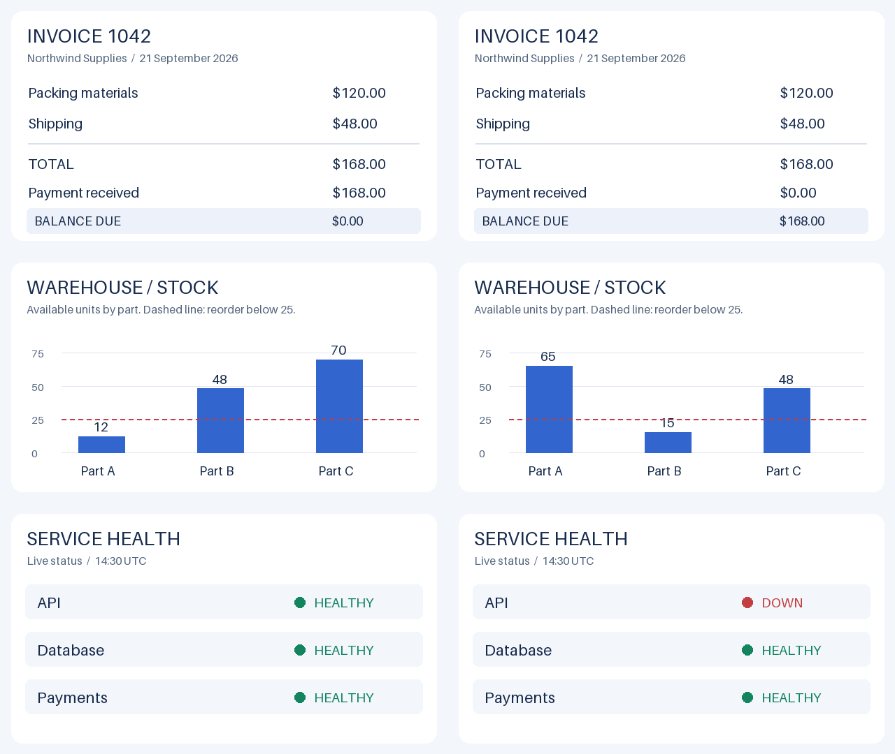

# S1Kit

**System One on your model.**

用Transformer完成分类、评分和真假判断。直接读取候选 logits，无需生成和解析回答文本。

[文档](docs/README.md) · [示例](examples/README.md) · [评测](benchmarks/README.md) · [贡献](CONTRIBUTING.md)

## 适合做什么

当结果范围已知时，可以直接定义候选及其条件：例如客服意图分流、按政策审核订单、故障等级评分，或根据图片判断库存与付款状态。每次调用都可以更换业务材料、问题和候选，无需为每组标签重新训练分类头。

S1Kit 复用基座的输出头，将候选映射到单 token 标签，对相应 logits 做归一化。判断质量来自基座及提示词；工具负责输入检查、独立执行和结构化读出。文本与多模态使用同一套决策接口，模型专用处理通过预处理函数绑定。

## 安装

Python 3.11+。安装 [uv](https://docs.astral.sh/uv/getting-started/installation/) 后，在仓库目录运行（CPU）：

```sh
uv sync --locked --extra cpu --extra transformers
```

CUDA 13.0 使用 `uv sync --locked --extra cu130 --extra transformers`；详细设备配置见[快速开始](docs/quickstart.md)。

## 使用

下面从本地加载带聊天模板的因果语言模型，在 CPU 上完成一次判断。将 `path` 改为模型目录；已有模型时从创建 `engine` 开始即可。

```python
import torch
from transformers import AutoModelForCausalLM, AutoTokenizer
from s1kit import SystemOne

path = "./my-model"
tokenizer = AutoTokenizer.from_pretrained(path, local_files_only=True)
model = AutoModelForCausalLM.from_pretrained(
    path, local_files_only=True, dtype=torch.float32,
)
engine = SystemOne.from_transformers(model, tokenizer)
answer = engine.choice(
    state={"message": "PDF 导出失败，但 CSV 可用。"},
    instructions="选择主要意图。",
    options={"bug": "功能故障", "feature": "新增功能请求"},
)
print(answer["choice"])
print(answer["probabilities"])
```

返回的 `choice` 是候选键，`probabilities` 包含每个候选的条件概率。模型加载、设备和权重由调用方管理；S1Kit 本身不下载模型。脚本运行与常见接入问题见[快速开始](docs/quickstart.md)。

### 决策与自定义规则

| 方法 | 用途 |
|---|---|
| `choice` | 2–255 个候选的概率与选择结果，例如将工单分配到处理队列 |
| `score` | 2–10 个有序等级的概率与索引期望，例如评估故障严重程度 |
| `noul` | 命题为真的条件概率，例如判断是否满足退款条件 |
| `decide` | 多道独立问题及完整 logits、token 用量 |

`state` 是业务证据，`instructions` 定义本题任务，候选描述定义可能的结果。系统提示词可以在创建引擎时设置，也可以只覆盖当前调用：

```python
answer = engine.noul(
    state={"has_receipt": True, "days_since_purchase": 12},
    instructions="有收据且购买不超过 30 天才符合退款条件，是否符合？",
    system_prompt="依据材料比较全部候选，只回答候选标签。",
)
print(answer["noul"])
```

候选标签须满足单 token 边界检查；255 项并非所有模型均可直接使用。参数和返回值见 [API 参考](docs/api.md)，自定义规则见[输入与提示词](docs/inputs.md)。

多题请求逐题独立执行：每题可见共享 state 和自身的全部候选，两题对应两次主干前向。预处理会额外探测标签边界，因此一次前向不等于只调用一次 processor。

## 示例与评测

```sh
uv run --no-sync python examples/text.py ./my-model
uv run --no-sync python examples/text.py ./my-model --customize
```

另有 [GPT-2 自定义预处理](examples/gpt2.py)与 [Qwen3.5 图文接入](examples/qwen.py)。图片案例覆盖发票、库存、运维，以及浏览器页面、文档和真实物品的交叉判断。

[](examples/vision/README.md)

复杂案例将三张不同尺寸的图片作为共同证据：页面提供订单和库存，文档提供有效政策，实物照片提供实际颜色。模型需要联合判断颜色是否相符、是否在售后期限内、对应商品是否有库存，再选择退款、换货或其他处理方式。

| 测试 | S1Kit + Qwen3.5-4B | TypeSafe Jev 1.13.0 |
|---|---|---|
| JevBench 公开题集 | 173/231 · 74.9% | 197/231 · 85.3% |
| 基础图文示例 | 5/6 | — |

上述结果测于 2026-09-21。本地使用 RTX 4060 Laptop、NF4 4-bit、BF16，未训练或校准；JevBench 使用全部 231 道公开题，不是官方榜单分数。图文数据是小规模应用示例，复杂多图的 1/5 表明该配置尚不能可靠完成此类判断。查看[评测方法与逐题数据](benchmarks/README.md)及[图文输入与失败案例](examples/vision/README.md)。

## 支持范围

支持单条无 padding 输入和普通稠密 `torch.nn.Linear` 输出头；多模态通过自定义预处理接入。模型特有的 logits 变换、量化输出头和批处理不在支持范围内。

概率仅在候选内归一化，confidence 不是正确率。完整约束与接入方式见 [API 参考](docs/api.md)。
