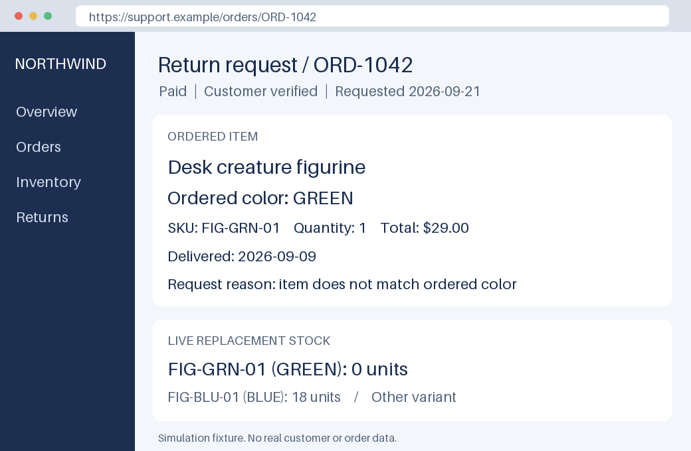
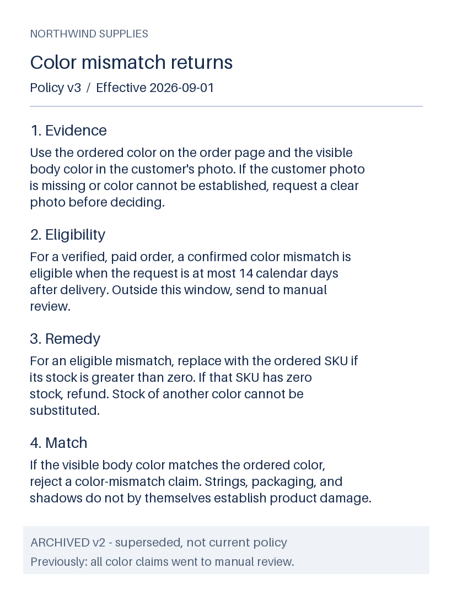
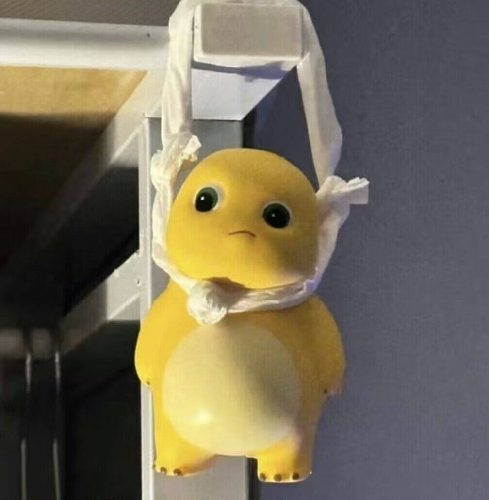

# 图文判断案例

[项目首页](../../README.md) · [示例运行方法](../README.md) · [评测与复现](../../benchmarks/README.md)

调用方将图片交给模型原生 processor，S1Kit 使用相同的判断接口读取结果。下列每组左右两张图使用完全相同的问题，只改变图片证据：

| 场景 | 问题 | 预期（左 / 右） | 实测（左 / 右） |
|---|---|---|---|
| 发票审核 | 是否已付清？ | 是 / 否 | 是 / 是，右图误判 |
| 库存补货 | 哪个零件低于 25 件？ | Part A / Part B | Part A / Part B |
| 运维分级 | 当前服务故障等级？ | 0（健康）/ 2（中断） | 0 / 2，按概率最高等级计分 |

本次基础图文 **5/6** 正确。图片、问题和标准答案见 [examples/vision](.)；[实测数据](../../benchmarks/results/2026-09-21/vision.json)保留完整分布和无图对照。这些是自行构造的应用示例。

### 多图交叉判断：售后处理

同时输入模拟订单页面（1040 × 680）、规则文档（820 × 1080）和真实物品照片（489 × 500）：

| 浏览器：订单与库存 | 文档：当前售后规则 | 实物：原始照片 |
|---|---|---|
|  |  |  |
| 1040 × 680 | 820 × 1080 | 489 × 500 |

**任务：这笔售后应如何处理？** 订单要求绿色商品，照片中的实物为黄色；签收至申请间隔 12 天，规则允许在 14 天内处理颜色不符的问题。是否换货还取决于对应 SKU 的库存。页面中另有其他颜色的库存，文档中另有已失效的旧规则，需要分别识别。

保持问题和实物照片不变，分别改变库存、订购颜色、签收日期，最后移除实物照作为对照：

| 输入条件 | 按规则应选择 | 模型实际选择 | 结果 |
|---|---|---|---|
| 颜色不符，12 天内，无库存 | 退款 | 转人工 | 错误 |
| 颜色不符，12 天内，有库存 | 换货 | 换货 | 正确 |
| 订购颜色改为黄色，与实物一致 | 驳回颜色不符申请 | 换货 | 错误 |
| 签收日期提前，已过 20 天 | 转人工 | 换货 | 错误 |
| 移除实物照片 | 要求补充照片 | 换货 | 错误 |

本次 **1/5** 正确，当前配置没有可靠完成跨图条件判断。原始照片未修改，订单和政策为虚构测试材料；这些少量案例用于展示行为与局限。[完整输入](complex/cases.json) · [逐项概率与图片校验值](../../benchmarks/results/2026-09-21/vision-complex.json)

